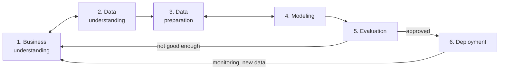

# 01 · The CRISP-DM workflow in this project

**CRISP-DM** (Cross-Industry Standard Process for Data Mining) is the most widely used framework for organizing data-science projects. It has six phases. The process is iterative and the sequence of the phases is not strcit and the project can move back and forth as needed..

## Phase by phase

| # | Phase | Description | Notebook |
|---|---|---|---|
| 1 | **Business understanding** | Define the goal. Specify success criteria. Identify the risks. | `notebooks/01_business_and_data_understanding.ipynb` (section 1) |
| 2 | **Data understanding** | Assess data quality. Describe data. Explore data. Recognize patterns. | `notebooks/01_business_and_data_understanding.ipynb` (section 2) |
| 3 | **Data preparation** | Data selection. Cleanse Data. Chronological split. Feature engineering. | `notebooks/02_data_preparation.ipynb` |
| 4 | **Modeling** | Select Models. Design Models. Build Models. Train Models. | `notebooks/03_modeling.ipynb` |
| 5 | **Evaluation** | Asses the model metrics compared with baselines. Verify success criteria is meet. | `notebooks/04_evaluation.ipynb` |
| 6 | **Deployment** | Plan deployment. Setup Model Monitoring. Define thresholds to retrain Model when it starts drifting. | `notebooks/05_deployment_demo.ipynb` |

**Design principle:** notebooks explain the project, while `src/` modules contain the Deep Learning Models logic and helper functions. This way the logic can be used again in the next iteration and the logic that was evaluated is exactly the logic that gets deployed.

## Suggested project reading order.
1. Read this document.
2. Run `notebooks/01` → `05` in order, keeping the matching `src/` file open next to each notebook.
3. Read `docs/02` (with notebook 02), `docs/03` (with notebook 03), `docs/04` (with notebook 04) and `docs/05` (with notebook 05).
4. Evaluate results, research possible improvement ideas and run a new CRISP-DM iteration.

## References
IBM. IBM SPSS Modeler CRISP-DM Guide. Version 18, Release 0, Modification 0. IBM Corporation, 2016.

Wikipedia contributors, "Cross-industry standard process for data mining," Wikipedia, The Free Encyclopedia, https://en.wikipedia.org/w/index.php?title=Cross-industry_standard_process_for_data_mining&oldid=1376004303 (accessed September 28, 2026).
